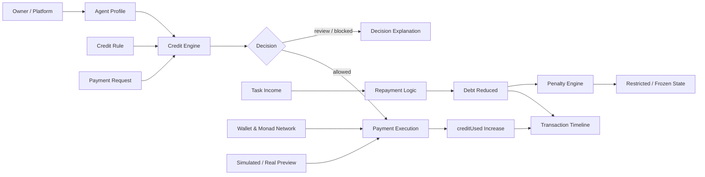

# Agent Credit

Agent Credit 是一个面向 AI Agent 的信用支付 MVP，目标是在 Monad 上展示这样一条最小闭环：Agent 不再只能消费已有余额，而是可以基于信誉获得可透支的支付额度，在任务收入到账后自动还款，并在逾期时触发惩罚。

## 一句话定义

让 AI Agent 在 Monad 上基于信誉获得可透支的支付信用线，从而在余额不足时仍能完成任务相关支付，并在任务收入到账后自动还款。

## Why This Matters

当前很多 AI Agent 已经能完成搜索、调用工具、生成内容和执行任务，但真正进入支付环节时，仍然依赖人工批准或预充值钱包。这会带来三个直接问题：

1. 普通钱包权限过大，直接交给 Agent 风险很高。
2. 预算钱包只能花已有余额，无法表达信誉驱动的支付能力。
3. 很多任务天然存在先支出、后回款的现金流结构，需要信用而不是余额。

Agent Credit 的核心主张不是“有钱才能支付”，而是“可信的 Agent 可以先支付，再用任务收入还款”。

## Core Loop

MVP 只证明最关键的五个动作：

1. Agent 拥有信誉分。
2. 信誉分决定信用额度。
3. 当钱包余额不足时，Agent 可以在额度内发起信用支付。
4. 任务收益到账后，系统自动优先还款。
5. 若逾期未还，则触发罚分、降额或冻结。

## Product Scope

本版本聚焦最小可信 Demo，不试图一次性解决完整去中心化征信问题。

本版本重点实现：

1. Agent 信誉档案展示。
2. 信用额度计算。
3. 信用支付决策。
4. 模拟支付执行。
5. 自动还款。
6. 逾期惩罚。
7. Monad 钱包连接与网络检测。
8. 交易时间线与状态回放。
9. 成功路径和失败路径演示。

本版本明确不做：

1. 完整的可信任务预言机。
2. 强身份绑定和抗女巫系统。
3. 开放式信贷市场。
4. 完整金融合规体系。
5. 复杂代币经济与服务商结算网络。

## Demo Story

推荐对外演示的主路径如下：

1. 选择一个高信誉 Agent。
2. 展示其余额不足，但仍具备可用信用额度。
3. 发起一笔 0.5 MON 的服务支付请求。
4. 系统根据信誉、额度、任务类型和风控规则给出允许决策。
5. 完成一笔模拟支付或真实小额支付。
6. 在任务收入到账后自动归还欠款。
7. 展示欠款减少、余额更新与信用状态恢复。

同时至少保留三类失败路径：

1. 超额度支付被 blocked。
2. 冻结 Agent 无法继续发起信用支付。
3. 不在白名单内的任务类型被 blocked 或 review。

Day 3 在此基础上再补三层演示能力：

1. 钱包连接与 Monad 网络状态展示。
2. simulated 和 real preview 模式切换。
3. 交易时间线与弱网回退提示。

## Credit Model

本版本采用足够直观的线性模型：

```text
activeCreditLimit = baseCreditLimit * reputationScore / 100
availableCredit = activeCreditLimit - creditUsed
```

支付判断优先检查：

1. Agent 是否被冻结。
2. 任务类型是否允许。
3. 支付金额是否小于等于 availableCredit。
4. 是否命中额外风险规则。

自动还款逻辑遵循：

1. 收入优先覆盖 creditUsed。
2. 若本金还清，可再结算极低手续费。
3. 剩余部分进入 Agent 钱包余额。
4. 若按时归还，可小幅恢复信誉。

## Roles In The System

1. Agent：执行任务、发起支付、接收收入并承担信用状态变化。
2. Platform / Owner：为 Agent 建立初始信誉档案，并触发任务结算或收益入账。
3. Service Provider：接收 Agent 支付，提供 API、算力、数据、存储或执行服务。
4. Credit Engine：负责额度计算、风险判断、违约检测和状态更新。

## Architecture

项目建议使用 Next.js + TypeScript 的前后端一体结构，核心分为四层：

1. Frontend：展示 Agent、额度、支付请求、决策、还款与惩罚状态。
2. Agent Credit Service：读取 Agent Profile，维护收入、欠款与上下文。
3. Risk & Rules Engine：输出 allowed、review、blocked 决策。
4. Payment & Repayment Execution：执行模拟支付或真实支付，并在收入到账后自动还款。

推荐技术栈：

1. Next.js App Router
2. TypeScript
3. Tailwind CSS
4. wagmi + viem
5. Next.js Route Handlers

推荐核心模块：

```text
src/
  app/
    providers.tsx
    page.tsx
    api/
      credit-decision/
      execute-credit-payment/
      settle-income/
  components/
    wallet-status-card.tsx
    transaction-timeline.tsx
    agent-profile-card.tsx
    credit-request-form.tsx
    credit-decision-card.tsx
    payment-execution-card.tsx
    repayment-card.tsx
    penalty-card.tsx
  lib/
    types.ts
    mock-data.ts
    credit-engine.ts
    penalties.ts
    monad.ts
  hooks/
    use-wallet.ts
    use-agent-credit.ts
```

### Architecture Diagram



这张图对应当前 Day 3 页面里的实际链路：

1. Agent Profile 和 Credit Rule 决定决策输入。
2. Credit Engine 输出 allowed、review、blocked。
3. allowed 后进入 Payment Execution，并更新 creditUsed。
4. 收入到账后进入 Repayment Logic，优先归还欠款。
5. 若逾期未还，则由 Penalty Engine 输出 restricted 或 frozen。
6. Wallet、Monad Network 和支付模式切换贯穿支付执行层。
7. 所有关键动作都会被写入时间线面板。

## Day 3 Highlights

当前版本已经补齐 Day 3 所需的展示能力：

1. 使用 wagmi + viem 提供浏览器钱包连接入口。
2. 页面可识别当前是否在 Monad 网络，并支持发起切网。
3. simulated 模式作为默认主路径，real 模式保留为可选 preview，未就绪时自动回退。
4. 支付执行、收入结算、惩罚应用与场景切换都会进入时间线面板。
5. 当接口不可用时，支付执行与收入结算都会自动回退到本地逻辑，保证现场演示连续性。

## Environment Variables

可选环境变量如下：

```env
NEXT_PUBLIC_MONAD_CHAIN_ID=10143
NEXT_PUBLIC_MONAD_CHAIN_NAME=Monad Testnet
NEXT_PUBLIC_MONAD_RPC_URL=https://testnet-rpc.monad.xyz
NEXT_PUBLIC_MONAD_EXPLORER_URL=https://testnet.monadexplorer.com
PAYMENT_MODE=simulated
```

说明：

1. 不配置时会自动使用 README 中的 Day 3 默认值。
2. 默认 PAYMENT_MODE 推荐保持为 simulated。
3. 即使切换到 real preview，当前版本在未完成链上签名时也会自动回退到 simulated。

## Run Locally

```bash
npm install
npm run dev
```

打开 http://localhost:3000 后，建议按下面顺序演示：

1. 先连接钱包，观察钱包与网络状态卡片。
2. 切换 Demo Case，复现成功路径或失败路径。
3. 执行信用支付，查看交易时间线是否记录结果。
4. 触发收入结算与惩罚，观察时间线和 Agent 状态更新。

## 3-Minute Pitch

### 30 秒：问题定义

今天很多 AI Agent 已经能完成搜索、调用工具和自动化任务，但一到支付这一步，往往还是要依赖人手动批准，或者提前给它充值一个预算钱包。

这会有两个问题：

1. 普通钱包风险太大，给 Agent 完整花钱权限不安全。
2. 预算钱包只能花已有余额，表达不了 Agent 的信誉和未来回款能力。

Agent Credit 解决的是这个缺口：不是“有余额才能支付”，而是“可信的 Agent 可以先支付，后还款”。

### 60 秒：方案说明

我们的模型非常简单，只保留最小闭环：

1. Agent 有信誉分。
2. 信誉分决定 activeCreditLimit。
3. 当余额不足时，Agent 可以在信用额度内发起支付。
4. 任务收入到账后，系统自动优先还款。
5. 如果逾期，则触发罚分、降额甚至冻结。

在实现上，我们把系统拆成四层：

1. 前端展示层，负责 Agent 档案、请求、决策、执行、还款和惩罚。
2. Credit Engine，负责额度计算和风控判断。
3. Payment & Repayment 层，负责 simulated 或 real preview 支付，以及自动还款。
4. Monad 接入层，负责钱包连接、网络检测和 Explorer 跳转。

### 60 秒：现场演示路径

现场演示时，我会这样走：

1. 先连接浏览器钱包，展示当前是否在 Monad 网络。
2. 选择高信誉 Agent，展示它虽然余额不足，但仍有可用信用额度。
3. 发起一笔 0.5 MON 的服务支付请求。
4. 系统根据额度、任务类型和状态规则输出 allowed。
5. 执行支付后，creditUsed 增加，时间线记录执行结果。
6. 随后模拟任务收入到账，系统自动还款，剩余负债下降。
7. 如果切到失败路径，比如超额度或冻结 Agent，系统会直接 blocked，并解释原因。

### 30 秒：为什么适合 Monad

Monad 的定位很适合机器经济里的高频、小额支付。Agent Credit 不是要把 AI 变成一个无约束的钱包，而是把它的可靠性转成一条可控、可回退、可惩罚的信用支付线。

所以这个项目的重点不是“AI 能不能点支付按钮”，而是“AI 在没有即时余额时，能不能基于信誉稳定完成支付，并在之后自动结算”。

## Demo Talking Points

如果评委追问，可以优先这样回答：

1. 为什么默认 simulated：因为主 demo 稳定性优先，real 模式是加分项，当前已保留入口并可回退。
2. 信誉分从哪里来：当前版本使用平台型信誉输入，先证明支付闭环，去中心化征信留在 roadmap。
3. 为什么不是普通预算钱包：预算钱包只表达余额，Agent Credit 表达的是信誉驱动的支付能力。
4. 怎么控制风险：通过任务类型白名单、额度上限、冻结状态检查、逾期惩罚和自动还款优先级共同控制。

## What Goes On-Chain

建议上链的内容：

1. Agent 信誉状态摘要。
2. 信用额度与已用额度。
3. 关键支付记录。
4. 欠款与还款状态。
5. 惩罚状态。

建议链下维护的内容：

1. 更复杂的信誉评分来源。
2. 服务商评价与风险特征。
3. Demo 用 mock 收益和历史记录。
4. 更细粒度的规则解释与辅助数据。

## MVP Deliverables

必须完成：

1. 一个可运行的 Demo 页面。
2. Agent Profile 展示。
3. 信用额度计算结果展示。
4. 信用支付决策展示。
5. 自动还款流程展示。
6. 至少 1 条成功路径。
7. 至少 2 条失败路径。

可选加分项：

1. 一笔真实 Monad 小额支付。
2. 简单链上状态展示。
3. 信誉变化时间线或动画。

## Roadmap

MVP 之后可以继续扩展：

1. 引入更真实的信誉评分来源。
2. 接入 DID 与更稳定的 Agent 身份系统。
3. 支持 Agent 之间互保和信用拆借。
4. 建立更完整的代币流通与赎回机制。
5. 形成服务商信誉和风险协同体系。

## Current Repository Status

当前仓库已经完成 Day 1 到 Day 3 的 MVP 主体：

1. Day 1：静态授信、决策和主页面骨架。
2. Day 2：支付执行、收入还款、惩罚和固定 Demo 用例。
3. Day 3：钱包连接、Monad 网络检测、支付模式切换、交易时间线和弱网回退。

## License

暂未指定。